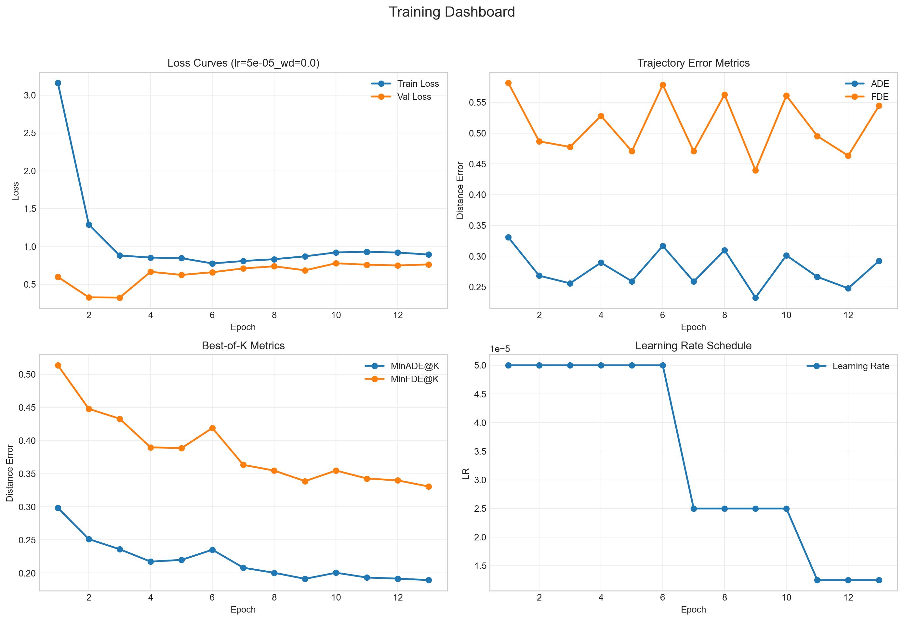

# Intent-Aware Trajectory Prediction

## Project Overview

Autonomous vehicles in urban environments must do more than detect pedestrians and cyclists — they must also anticipate how those agents are likely to move next. Reacting only to current position is not enough for safe navigation. This project focuses on **intent-aware trajectory prediction**, where the goal is to predict several realistic future paths for vulnerable road users using past motion, surrounding agents, and scene context.

Given **2 seconds of past motion history** represented as position and velocity, the model predicts **3 seconds of future movement**. The system is designed to handle:

- **Multiple possible futures** — a pedestrian may stop, continue, or turn
- **Social interactions** — nearby agents influence motion decisions
- **Scene awareness** — drivable area, walkways, and crossings constrain valid futures

The final model produces **multi-modal trajectory predictions**, helping autonomous systems act more safely and proactively.

---

## Key Features

- Transformer-based **temporal encoder** for past motion history
- CNN-based **scene encoder** using rasterized local map crops
- Graph-based **social encoder** for nearby agent interactions
- **Winner-Takes-All (WTA)** multi-modal training objective
- **FastAPI inference service**
- **Dockerized inference deployment**
- Unit-tested core components:
  - prediction head
  - loss
  - metrics
  - full model forward path

---

## Model Architecture

The system follows this pipeline:

**Data Pipeline → Temporal Encoder → Scene Encoder → Social Encoder → Fusion → Multi-Modal Prediction Head**

### 1. Data Pipeline

For each valid target agent, the dataset prepares:

- `agent`: past trajectory history in agent-centric coordinates
- `neighbors`: nearby agents within a local interaction radius
- `map`: rasterized local semantic map crop
- `target`: future trajectory for supervision

Current tensor contracts:

- `agent`: `[T_past, 4]` where each step is `[x, y, vx, vy]`
- `neighbors`: `[N, T_past, 4]`
- `map`: `[3, H, W]`
- `target`: `[T_future, 2]`

### 2. Temporal Encoder

The temporal branch processes the target agent’s motion history using a Transformer encoder.

Input:
- `agent`: `[B, T_past, 4]`

Output:
- `agent_embed`: `[B, T_past, D]`

### 3. Scene Encoder

The scene branch processes a rasterized local semantic map crop using a CNN backbone based on ResNet-18.

Input:
- `map`: `[B, 3, H, W]`

Output:
- `scene_embed`: `[B, D]`

A **20m × 20m** local crop around the target agent is used to focus on relevant map context.

### 4. Social Encoder

The social branch models interactions with neighboring agents using an STGCN-inspired graph encoder.

Input:
- `neighbors`: `[B, N, 4]` or `[B, N, T_past, 4]`
- `agent_embed`: `[B, T_past, D]`

Output:
- `social_embed`: `[B, D]`

Note: if neighbors arrive as `[B, N, T_past, 4]`, the integration layer safely adapts them to spatial form using the most recent timestep before passing them into the social encoder.

### 5. Fusion and Prediction Head

The final fused representation is formed by concatenating:

```python
fused = concat(
    agent_embed[:, -1],
    scene_embed,
    social_embed
)
```

This fused tensor is passed to the prediction head.

Current standardized model config:
- `embed_dim = 128`
- `num_modes = 3`
- `future_steps = 6`

Output:
- `trajectories`: `[B, 3, 6, 2]`
- `mode_logits`: `[B, 3]`

### 6. Training Objective

The model is trained with a **Winner-Takes-All (WTA)** objective:

- compute displacement error for all modes
- choose the best-matching mode
- backpropagate regression loss through that best mode
- train the mode logits using cross-entropy against the best mode index

---

## Metrics Used

The project currently evaluates:

- **ADE** — Average Displacement Error
- **FDE** — Final Displacement Error
- **MinADE@K**
- **MinFDE@K**

---

## Best Current Results

Best validated 3-mode checkpoint:

- **Validation Loss:** `0.1292`
- **ADE:** `0.2525`
- **FDE:** `0.4769`
- **MinADE@K:** `0.2449`
- **MinFDE@K:** `0.4574`

These values are also exported to:

```txt
checkpoints/eval_summary.json
```

---

## Training Plot

The training plot for the best tracked run is included here:



---

## Dataset Used

### Primary Dataset

This project uses the **nuScenes** dataset.

Why nuScenes:
- multi-agent urban scenes
- temporal agent tracks
- semantic map information
- realistic urban interaction patterns

### Temporal Setup

- **Past horizon:** 2 seconds
- **Future horizon:** 3 seconds

### Typical Agent Categories

The current dataset filtering focuses on motion forecasting categories such as:
- pedestrians
- bicycles
- motorcycles

### Local Map Representation

The map branch uses a **20m × 20m** local crop and rasterizes semantic layers such as:
- drivable area
- walkway
- pedestrian crossing

---

## Project Structure

```txt
INTENT-AWARE_TRAJECTORY_PREDICTION/
├── app/
│   ├── api.py
│   ├── dataloader.py
│   ├── dataset.py
│   ├── full_model.py
│   ├── loss.py
│   ├── metrics.py
│   ├── prediction_head.py
│   ├── schemas.py
│   ├── scene_encoder.py
│   ├── social_encoder.py
│   ├── temporal_encoder.py
│   └── utils.py
├── checkpoints/
│   ├── best_model.pt
│   ├── eval_summary.json
│   └── training_plot_lr_5e-05_wd_0p0.png
├── scripts/
│   ├── train.py
│   ├── train_smoke.py
│   ├── evaluate.py
│   └── infer.py
├── tests/
│   ├── test_prediction_head.py
│   ├── test_loss.py
│   ├── test_metrics.py
│   └── test_full_model.py
├── Dockerfile
├── requirements.txt
└── README.md
```

---

## Setup & Installation (Local)

### 1. Create and activate a virtual environment

From the project root:

```bash
python -m venv venv
```

Activate it:

**PowerShell**
```bash
.\venv\Scripts\Activate.ps1
```

**CMD**
```bash
venv\Scripts\activate
```

### 2. Upgrade pip

```bash
python -m pip install --upgrade pip
```

### 3. Install project dependencies

```bash
pip install -r requirements.txt
```

### 4. Install PyTorch separately

PyTorch is intentionally **not** included in `requirements.txt` because local GPU training and CPU-only deployment may require different builds.

#### For local GPU training (example: CUDA 12.6)

```bash
python -m pip install torch torchvision torchaudio --index-url https://download.pytorch.org/whl/cu126
```

#### Verify PyTorch

```bash
python -c "import torch; print(torch.__version__)"
python -c "import torch; print('CUDA available:', torch.cuda.is_available())"
python -c "import torch; print(torch.cuda.get_device_name(0) if torch.cuda.is_available() else 'CPU')"
```

---

## Dataset Setup

Keep the nuScenes dataset **outside the repository**.

Your loader expects a layout like:

```txt
<dataroot>/
└── v1.0-mini/
    ├── category.json
    ├── sample.json
    ├── scene.json
    └── ...
```

### Important note for this project’s current local setup

If your files actually live under:

```txt
C:\Users\<user>\Documents\MAHE_MOBILITY\v1.0-mini\v1.0-mini\...
```

then your `--dataroot` should be:

```txt
C:\Users\<user>\Documents\MAHE_MOBILITY\v1.0-mini
```

because the code resolves data as:

```txt
<dataroot>/<version>/...
```

---

## Running the Project Locally

### 1. Train the model

Run full training:

```bash
python scripts/train.py --dataroot "C:\Users\<user>\Documents\MAHE_MOBILITY\v1.0-mini" --version v1.0-mini
```

This will:
- train the model
- evaluate on validation data during training
- save the best checkpoint to `checkpoints/best_model.pt`
- save the training plot to `checkpoints/training_plot_lr_5e-05_wd_0p0.png`

### 2. Smoke test training

```bash
python scripts/train_smoke.py --dataroot "C:\Users\<user>\Documents\MAHE_MOBILITY\v1.0-mini" --version v1.0-mini
```

### 3. Evaluate the checkpoint

```bash
python scripts/evaluate.py --dataroot "C:\Users\<user>\Documents\MAHE_MOBILITY\v1.0-mini" --version v1.0-mini --checkpoint checkpoints/best_model.pt --output_json checkpoints/eval_summary.json
```

### 4. Run local inference from one validation sample

```bash
python scripts/infer.py --dataroot "C:\Users\<user>\Documents\MAHE_MOBILITY\v1.0-mini" --version v1.0-mini --checkpoint checkpoints/best_model.pt
```

Optional JSON output:

```bash
python scripts/infer.py --dataroot "C:\Users\<user>\Documents\MAHE_MOBILITY\v1.0-mini" --version v1.0-mini --checkpoint checkpoints/best_model.pt --output_json checkpoints/sample_inference.json
```

### 5. Start the FastAPI server locally

```bash
uvicorn app.api:app --reload
```

Then open:

- API root: `http://127.0.0.1:8000/`
- Swagger docs: `http://127.0.0.1:8000/docs`

---

## Docker Usage

The Docker image is intended for **inference/API serving only**.

### What Docker includes

- application code
- trained checkpoint
- evaluation summary JSON
- training plot image

### What Docker does not include

- nuScenes dataset
- training workflow
- evaluation workflow

### Build the image

```bash
docker build -t intent-trajectory-api .
```

### Run the container

If port `8000` is free:

```bash
docker run -p 8000:8000 intent-trajectory-api
```

If port `8000` is already in use, run on a different host port, for example `8001`:

```bash
docker run -p 8001:8000 intent-trajectory-api
```

### Open the API from your local machine

If you ran with `-p 8000:8000`, open:

- `http://127.0.0.1:8000/`
- `http://127.0.0.1:8000/docs`

If you ran with `-p 8001:8000`, open:

- `http://127.0.0.1:8001/`
- `http://127.0.0.1:8001/docs`

### Important note about `0.0.0.0`

Inside Docker, Uvicorn runs on:

```txt
0.0.0.0:8000
```

This is correct. It means the server listens on all container interfaces so your host machine can reach it through the published port.

From your browser, you should still open:

```txt
http://127.0.0.1:<host_port>
```

not `0.0.0.0`.

---

## API Input Format

`POST /predict` expects:

- `agent`: `[B, T_past, 4]`
- `neighbors`: `[B, N, 4]` or `[B, N, T_past, 4]`
- `map_img`: `[B, 3, H, W]`

For a single sample, a typical structure is:

- `agent`: `[1, 4, 4]`
- `neighbors`: `[1, N, 4, 4]` or `[1, N, 4]`
- `map_img`: `[1, 3, 224, 224]`

Feature layout:
- `[x, y, vx, vy]`

### API Output

The API returns:

- `trajectories`: `[B, 3, 6, 2]`
- `mode_probabilities`: `[B, 3]`

---

## Example Inference Output

```json
{
  "trajectories": [
    [
      [
        [-0.0845, 0.0079],
        [0.0537, 0.0539],
        [0.0866, -0.0115],
        [-0.0339, -0.0069],
        [0.1331, -0.0082],
        [-0.1287, -0.0444]
      ],
      [
        [0.0032, -0.0596],
        [-0.1524, 0.0448],
        [0.0599, -0.0428],
        [0.0277, 0.0230],
        [-0.0098, 0.0602],
        [0.1062, -0.0209]
      ],
      [
        [0.0397, 0.0979],
        [0.1246, -0.1246],
        [-0.0668, -0.2123],
        [-0.0048, 0.1250],
        [0.0443, -0.0605],
        [0.0996, -0.0610]
      ]
    ]
  ],
  "mode_probabilities": [
    [0.0001, 0.9904, 0.0095]
  ]
}
```

This means:
- batch size = `1`
- the model returned `3` possible future trajectories
- each trajectory contains `6` future `(x, y)` points
- `mode_probabilities` gives confidence over the 3 predicted modes

---

## Running Tests

Run all current unit tests:

```bash
pytest tests/test_prediction_head.py tests/test_loss.py tests/test_metrics.py tests/test_full_model.py -q
```

---

## Current Status

The project currently supports:

- end-to-end training on nuScenes
- multi-modal trajectory prediction
- checkpoint evaluation
- local inference
- FastAPI-based prediction serving
- Docker-based inference deployment
- tested core modules
